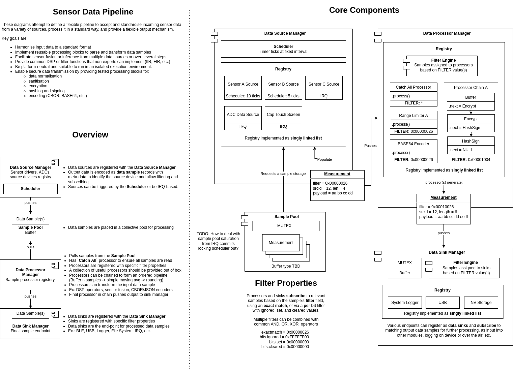

.. _sensor_pipeline:

Secure Data Pipeline (SDP) for Zephyr
#####################################

Overview
********

An experimental data processing pipeline that can be used with any
:ref:`supported board <boards>`.

Adding sdp to your project via ``west``
***************************************

For projects that have been setup using ``west``, you can add a local copy of
this module by adding the following sections to ``zephyr/west.yml``:

1. In the ``manifest/remotes`` section add:

.. code-block::

   remotes:
     - name: microbuilder
       url-base: https://github.com/microbuilder

2. In the ``manifest/projects`` section add:

.. code-block::

   - name: linaro_sensor_pipeline
     remote: microbuilder
     path: modules/lib/sdp
     revision: master

3. Save the file, and run ``west update`` from the project root to retrieve the
latest version of the library from Github, or whatever ``revision`` was
specified above.

Building and Running
********************

This application can be built and executed on QEMU as follows:

.. zephyr-app-commands::
   :zephyr-app: modules/lib/sdp/samples/shell
   :host-os: unix
   :board: qemu_cortex_m3
   :goals: run
   :compact:

To build for another board, change "qemu_cortex_m3" above to that board's name.

Sample Output
=============

.. code-block:: console

   TODO

Exit QEMU by pressing :kbd:`CTRL+A` :kbd:`x`.

Running Unit Tests
==================

To run the unit tests for this module, you can run ``twister`` via:

.. code-block:: console

   $ cd $ZEPHYR_BASE
   $ ./scripts/twister --inline-logs \
     -p qemu_cortex_m3 \
     -T ../modules/lib/sdp/tests
